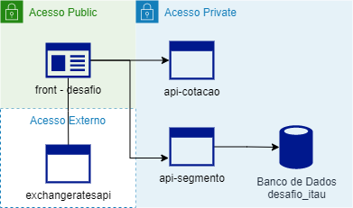

# Desafio Itaú Unibanco

### Necessidade

"A área de negócio verificou a necessidade de parametrizar o valor cobrado para compra de moedas estrangeiras por segmento de cliente, pois hoje cobramos a mesma taxa para todos os clientes." 

### Fórmula 

Formula para calcular o valor total da conversão da moeda estrangeira para Real:

> α = (β * γ) * 1 + ϕ)
>
>Onde:
> * α = valor em Reais
> * β = quantidade desejada da moeda estrangeira
> * γ = taxa de conversão da moeda estrangeira para Real
> * ϕ = taxa parametrizada por segmento

## Aplicação

Para atender a solicitação, foram criadas:
* 1 Aplicação FrontEnd - .NetCore 3.1
* 2 APIs - Angular 12
* 1 Banco de Dados - MSQLServer

### Desenho

